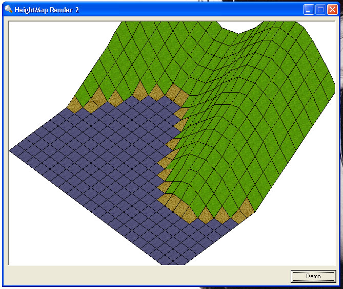



## Isometric 3d Renderer 2

### Description

This is the new version of my isometric 3d Renderer, it can now handle sloping landscapes and such and its possible to move around inside it as shown in the demo mode. It uses its own Rastering Code and only uses a few common API's and nothing special yet can achieve very nice effects, have a look and see.
 
### More Info
 

             |
---                |---
**Submitted On**   |2004-05-31 13:52:18
**By**             |[Kevin Pfister](https://github.com/Planet-Source-Code/PSCIndex/blob/master/ByAuthor/kevin-pfister.md)
**Level**          |Intermediate
**User Rating**    |4.0 (8 globes from 2 users)
**Compatibility**  |VB 6\.0
**Category**       |[Graphics](https://github.com/Planet-Source-Code/PSCIndex/blob/master/ByCategory/graphics__1-46.md)
**World**          |[Visual Basic](https://github.com/Planet-Source-Code/PSCIndex/blob/master/ByWorld/visual-basic.md)
**Archive File**   |[Isometric\_1752135312004\.zip](https://github.com/Planet-Source-Code/kevin-pfister-isometric-3d-renderer-2__1-54110/archive/master.zip)

